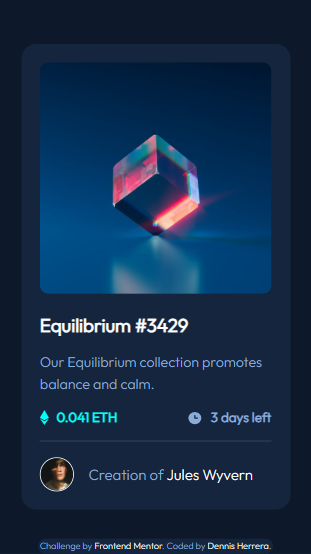

# Frontend Mentor - NFT preview card component solution

This is a solution to the [NFT preview card component challenge on Frontend Mentor](https://www.frontendmentor.io/challenges/nft-preview-card-component-SbdUL_w0U). Frontend Mentor challenges help you improve your coding skills by building realistic projects. 

## Table of contents

- [Overview](#overview)
  - [Screenshot](#screenshot)
  - [Links](#links)
- [My process](#my-process)
  - [Built with](#built-with)
  - [What I learned](#what-i-learned)
- [Author](#author)

## Overview

### Screenshot




### Links

- Solution URL: [Frontend mentor](https://www.frontendmentor.io/profile/Klonnister/solutions)
- [Live site](https://klonnister.github.io/NFT-preview-card/)

## My process

### Built with

- Semantic HTML5 markup
- CSS custom properties
- Flexbox
- Mobile-first workflow

**Note: These are just examples. Delete this note and replace the list above with your own choices**

### What I learned

I practiced centering the card in the webpage

```css
body{
    min-height: 100vh;
    width: 100%;
    display: flex;
    justify-content: center;
    align-items: center;
}
```

Learned how to use the property inset in css to center the image:

```css
.view-img {
    position: absolute;
    inset: 0;
    margin: auto;
}
```

## Author

- Frontend Mentor - [Klonnister](https://www.frontendmentor.io/profile/Klonnister)
- Twitter - [dennis_herrera_f](https://www.instagram.com/dennis_herrera_f/)
